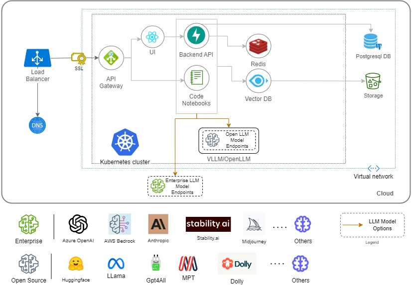

.. 'Max.AI LLM' documentation master file, created by
   sphinx-quickstart on Tue Jan 16 13:45:10 2024.
   You can adapt this file completely to your liking, but it should at least
   contain the root `toctree` directive.

Welcome to Max.AI LLM's documentation!
========================================
**Max.AI LLM**  is a comprehensive toolkit designed to streamline the entire lifecycle of building, refining, deploying, and managing Language Model (LLM) applications. This module encapsulates a suite of powerful submodules, each addressing a specific facet of the application development process. By providing developers and data scientists with a range of tools and functionalities, this utility module accelerates the creation of sophisticated LLM-powered applications while ensuring security, compliance, and user-friendly interfaces.

Max.AI Gen.AI platform's core capabilities include:
    - Cloud Agnostic Platform
    - Support for all foundational models
    - Support in-house and third party plug-ins
    - Best in class system integration
    - Prompting and embedding layers
    - Fine-tuning and optimization
    
    
Max.AI LLM Architecture
^^^^^^^^^^^^^^^^^^^^^^^

    
|
|

.. toctree::
   :maxdepth: 2
   :hidden:
   :caption: 🧠 Max.AI LLM
   
   getting_started 
   agents
   app
   data
   documents
   model
   tuning

|

.. toctree::
   :maxdepth: 2
   :caption: 🔗 Data Integration

   data_integration/architecture
